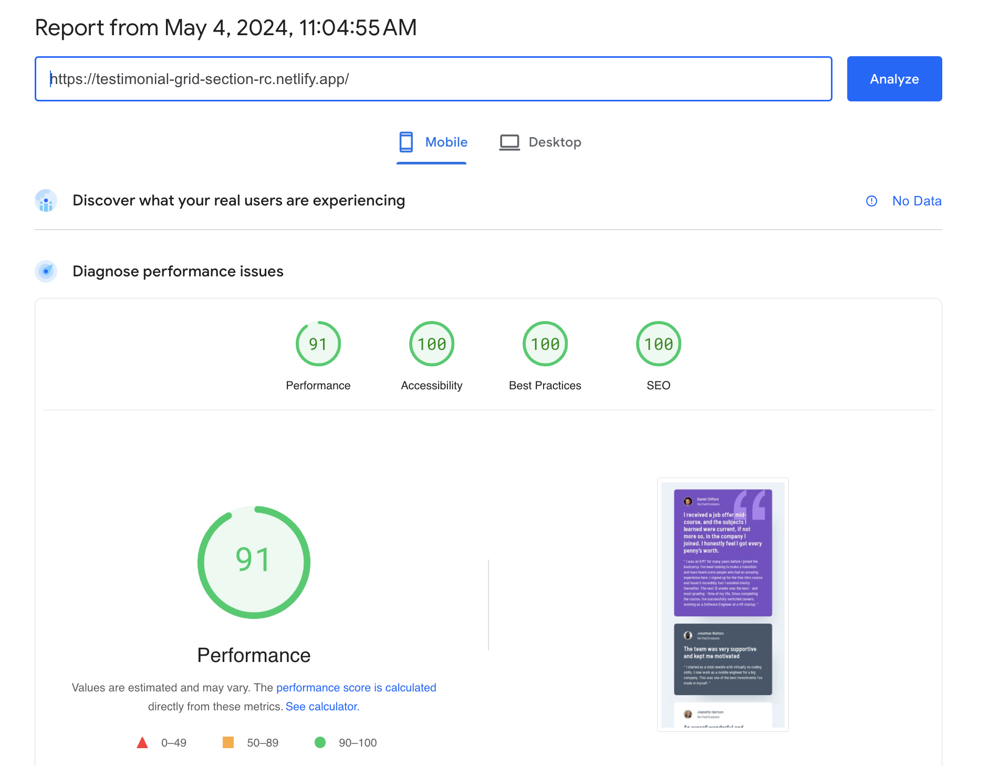
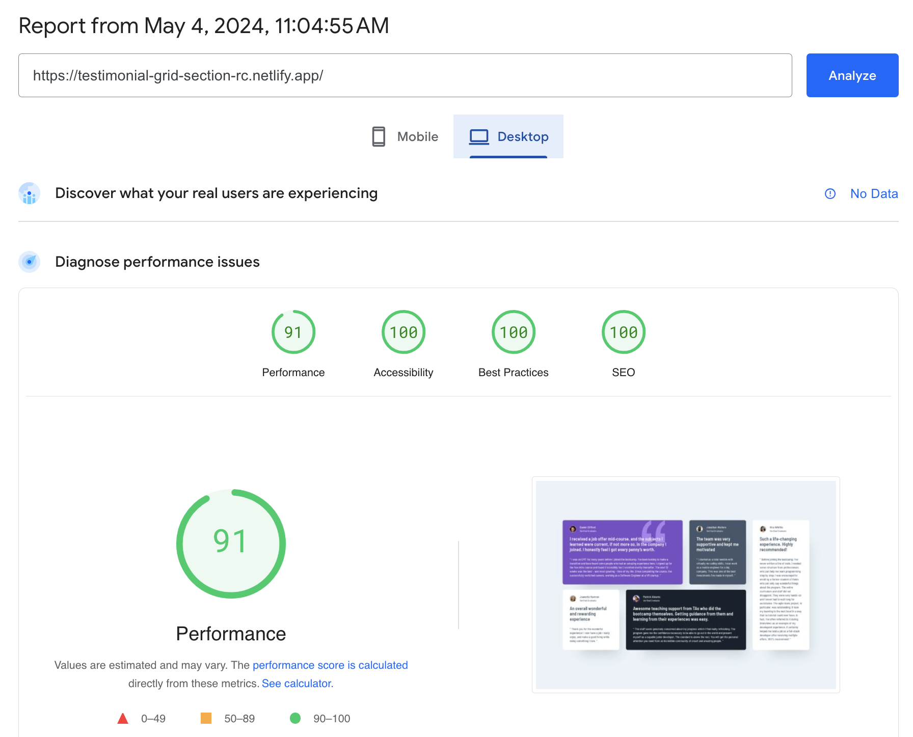

# Frontend Mentor - Testimonials grid section solution

This is a solution to the [Testimonials grid section challenge on Frontend Mentor](https://www.frontendmentor.io/challenges/testimonials-grid-section-Nnw6J7Un7). Frontend Mentor challenges help you improve your coding skills by building realistic projects.

## Table of contents

- [Overview](#overview)
  - [The challenge](#the-challenge)
  - [Screenshots](#screenshots)
    - [1. Desktop version](#1-desktop-version)
    - [2. Mobile version](#2-mobile-version)
  - [PageSpeed Insights results](#pagespeed-insights-results)
  - [Links](#links)
- [My process](#my-process)
  - [Built with](#built-with)
  - [Tested with](#tested-with)
  - [Continued development](#continued-development)
  - [Useful resources](#useful-resources)
- [Author](#author)
- [Acknowledgments](#acknowledgments)

## Overview

### The challenge

Users should be able to:

- View the optimal layout for the site depending on their device's screen size.

### Screenshots

##### 1. Desktop version

##### 2. Mobile version

### PageSpeed Insights results

[Mobile version](https://pagespeed.web.dev/analysis/https-testimonial-grid-section-rc-netlify-app/qa8e9gum1c?form_factor=mobile)

[Desktop version](https://pagespeed.web.dev/analysis/https-testimonial-grid-section-rc-netlify-app/qa8e9gum1c?form_factor=desktop)

### Links

- Solution URL: [Testimonial grid section Github URL](https://github.com/rupali317/testimonials-grid-section)
- Live Site URL: [Testimonial grid section live URL](https://testimonial-grid-section-rc.netlify.app/)

## My process

### Built with

- Semantic HTML5 markup
- CSS custom properties
- Flexbox
- CSS Grid
- Mobile-first workflow
- [React](https://reactjs.org/) - JS library
- [Styled Components](https://styled-components.com/) - For styles
- [Netlify](https://www.netlify.com/) - A cloud platform that provides hosting services

### Tested with

- Browsers used for testing: Google Chrome, Firefox, Safari, Brave, Microsoft Edge.
- Devices:
  - (Real) MacBook Pro (15-inch), Samsung Galaxy A33 5G, Samsung Galaxy S20+, iPad Air 2, MacBook Pro (13-inch).
  - (Virtual) The mobile and tablet devices mentioned under Chrome's dev console.
- Screen reader: MacOS VoiceOver.

### Continued development

- Investigate how to improve the performance (reduce layout shifts and improve the total blocking time).

### Useful resources

- [Learn CSS Grid the easy way](https://www.youtube.com/watch?v=rg7Fvvl3taU&ab_channel=KevinPowell) - Provides the demo of CSS grids basics. A good refresher.
- [A guide to learning CSS grid](https://learncssgrid.com/) - Provides a clear documentation of the Grid functionalities.

## Author

- Website - [Rupali Roy Choudhury](https://www.linkedin.com/in/rupali-rc/)
- Frontend Mentor - [@rupali317](https://www.frontendmentor.io/profile/rupali317)

## Acknowledgments

- I express my gratitude towards my mentor - Deborah for the insightful code review session.
